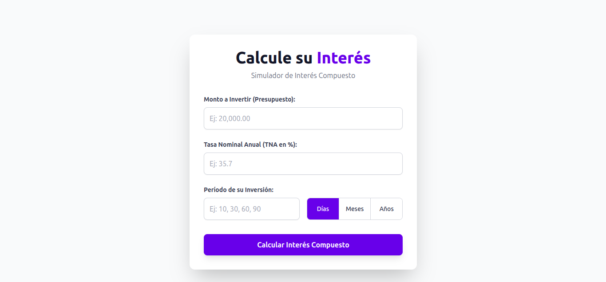
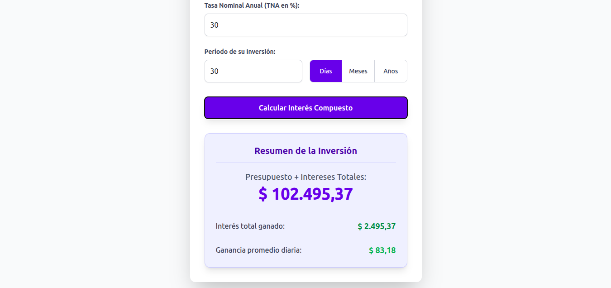

# 📈 Simulador de Interés Compuesto

Bienvenido al **Simulador de Interés Compuesto**, una aplicación web simple e intuitiva construida con React y estilizada con Tailwind CSS. Esta herramienta permite a los usuarios calcular el crecimiento de su inversión inicial (presupuesto) en función de una Tasa Nominal Anual (TNA) y un período definido (días, meses o años).

El diseño moderno y responsivo garantiza una experiencia de usuario fluida en cualquier dispositivo.

## ✨ Características Principales

* **Cálculo de Interés Compuesto:** Utiliza la fórmula financiera estándar para proyectar el monto final de la inversión.
* **Diseño Moderno (Tailwind CSS):** Interfaz limpia, minimalista y totalmente responsiva.
* **Selección de Período Flexible:** Permite ingresar el período de inversión en Días, Meses o Años.
* **Validación de Datos:** Manejo robusto de errores para asegurar que se ingresen valores numéricos positivos.
* **Resultados Detallados:** Muestra el monto total final, el interés total ganado y la ganancia promedio diaria.

## 💻 Tecnologías Utilizadas

* **React:** Para la construcción de la interfaz de usuario.
* **Tailwind CSS:** Framework CSS utility-first para un estilizado rápido y moderno.
* **JavaScript:** Lógica de cálculo y manejo de estados.

## 📄 Licencia

Este proyecto está bajo la Licencia MIT. Consulta el archivo [LICENSE](LICENSE) para más detalles.